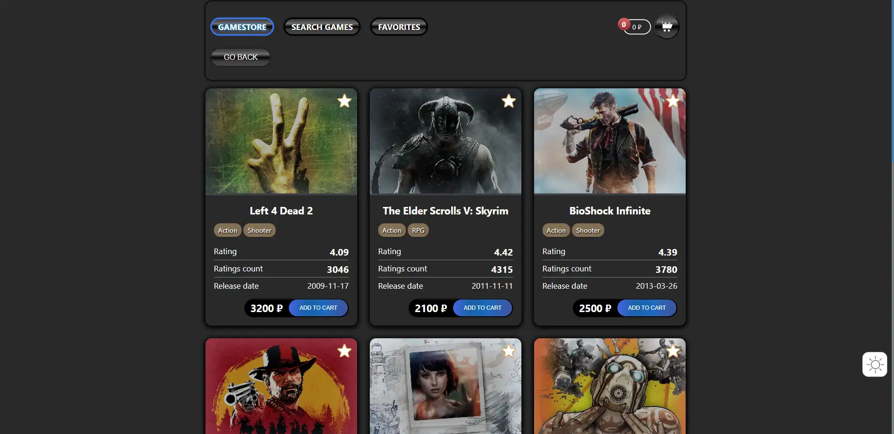
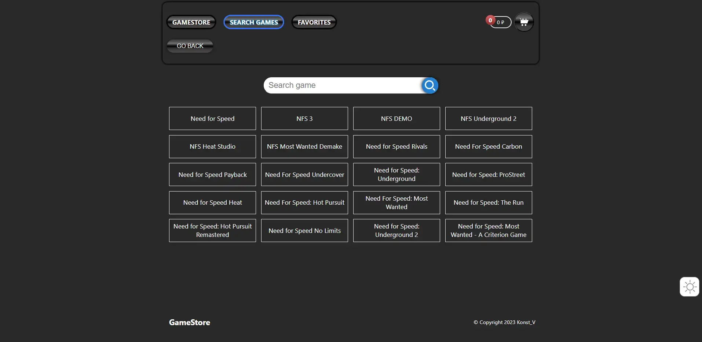
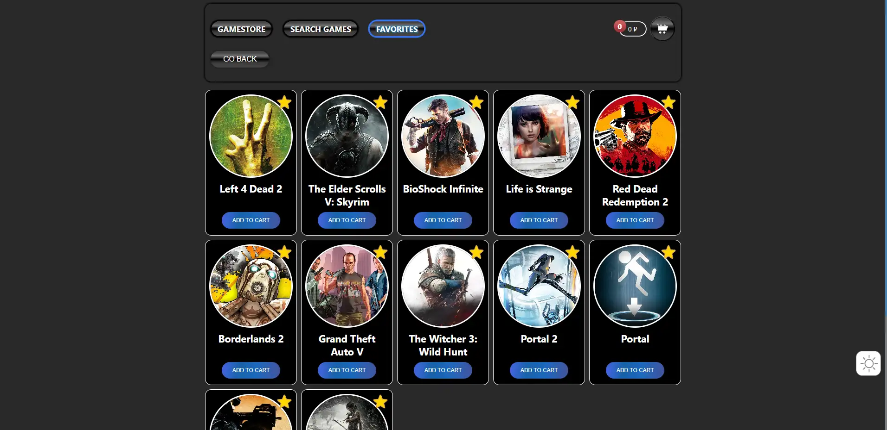
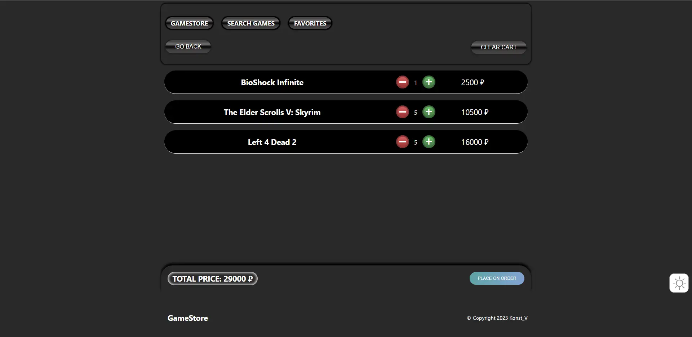
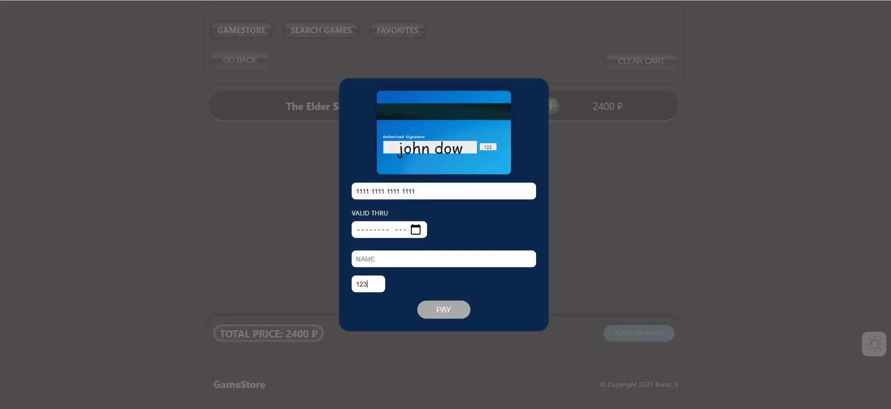

# Games Store React App

This project [Demo](https://konst1984.github.io/games_store/).

## Available Scripts

Used API: [RAWG Video Games Database API](https://api.rawg.io/docs/). 

Used by the library:

 - react-hook-form
 - react-intersection-observer
 - @headlessui/react
 - framer-motion
 - @reduxjs/toolkit
 - sass
 - react-intersection-observer
 - react-scroll

